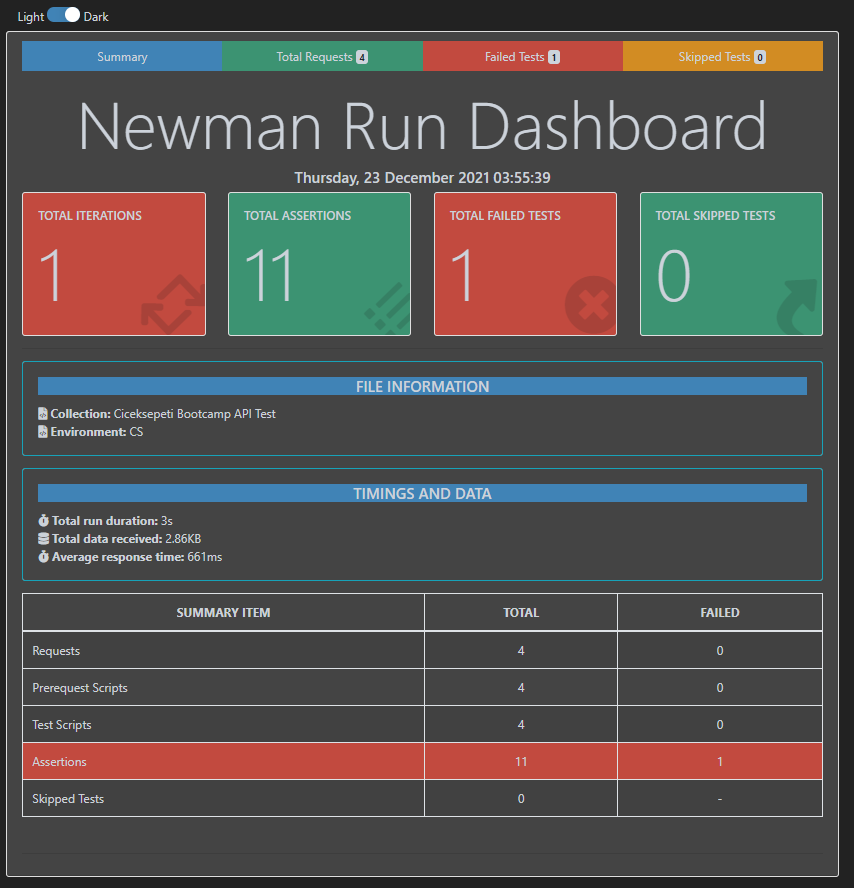
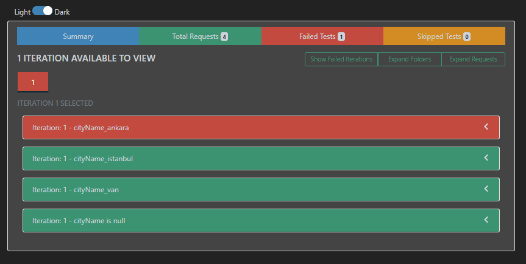
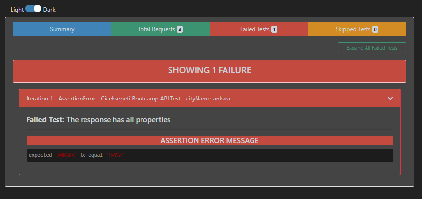

[](https://github.com/berkaypab?tab=repositories)
<br/>
# Çiçek Sepeti Postman Integration Tests


## API Request

1-)
```http
  GET baseURL/?cityName={cityName}
```

| Parameter | Value     | 
| :--------- | :--------- |
| `cityName` | `ankara`   | 
| `cityName` | `istanbul` |

## Tests
#### reviewDtos response type check

- reviewDtos.name typeof==string 
- reviewDtos.comment typeof==string 
- reviewDtos.rating typeof==integer
- reviewDtos.createOn typeof==string
- reviewDtos.regionName typeof==string
- reviewDtos.cityName typeof==string

#### reviewDtos instance size should be 6

- is reviewDtos object size equal to 6 ? 

#### reviewDtos cityName check 

- is reviewDtos cityName value euqal to {cityName} parameter ?

#### reviewDtos rating check

- is reviewDtos rating range between 0-10 ?

#### Response time check
- is Response time is less than 200ms ?

2-) 
```http
  GET baseURL/?cityName=van
```


| Parameter  | Value     | 
| :--------  | :-------- |
| `cityName` | `van`     | 


#### Response status code check
- is Response code value 404 ?
#### Message value check
- is message value equal to 'Not found' ?
#### Response object contains
- is response object equal to given structure "message": "Not found" ?
#### Response time check
- is Response time less then 1000ms ?

3-)
```http
  GET baseURL/?cityName=
```
| Parameter | Value    | 
| :-------- | :------- |
| `cityName`|          | 

#### response status code check
- is Response status code 400 ?
#### cityName value check
- cityName value equal to 'cityName' can not be null.'  ?
#### Response object contains
- is response object equal to given structure "cityName": ["'cityName' can not be null."] ?
#### Response time check
- is Response time less then 1000ms ?

## Test Results
[](https://github.com/berkaypab?tab=repositories)
<br/>
# SUMMARY


# TOTAL REQUESTS


# FAILED TESTS


[](https://github.com/berkaypab?tab=repositories)
<br/>
